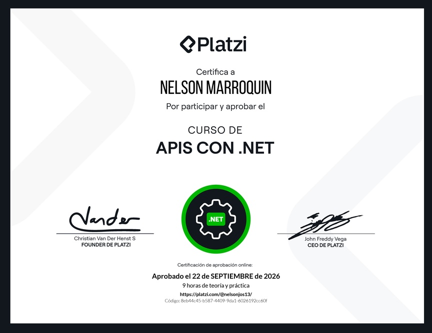
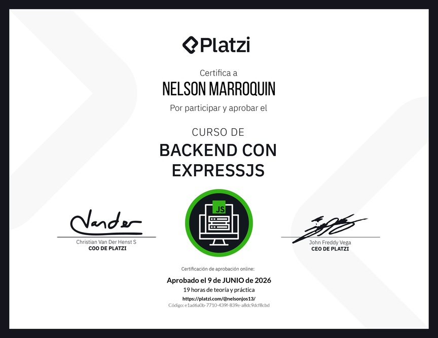
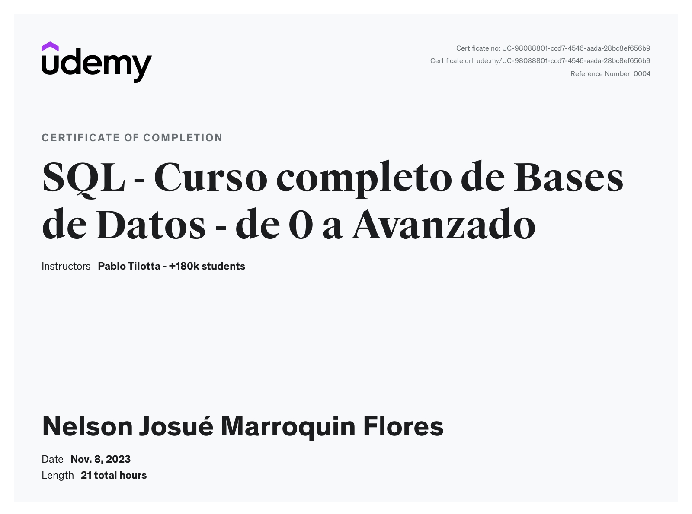
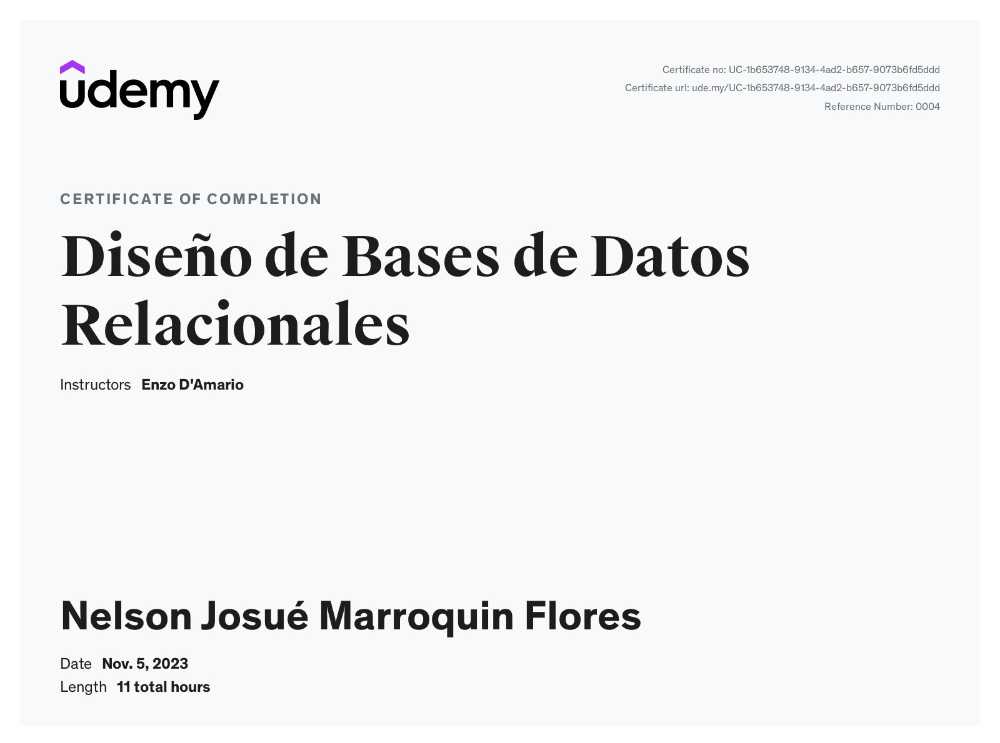
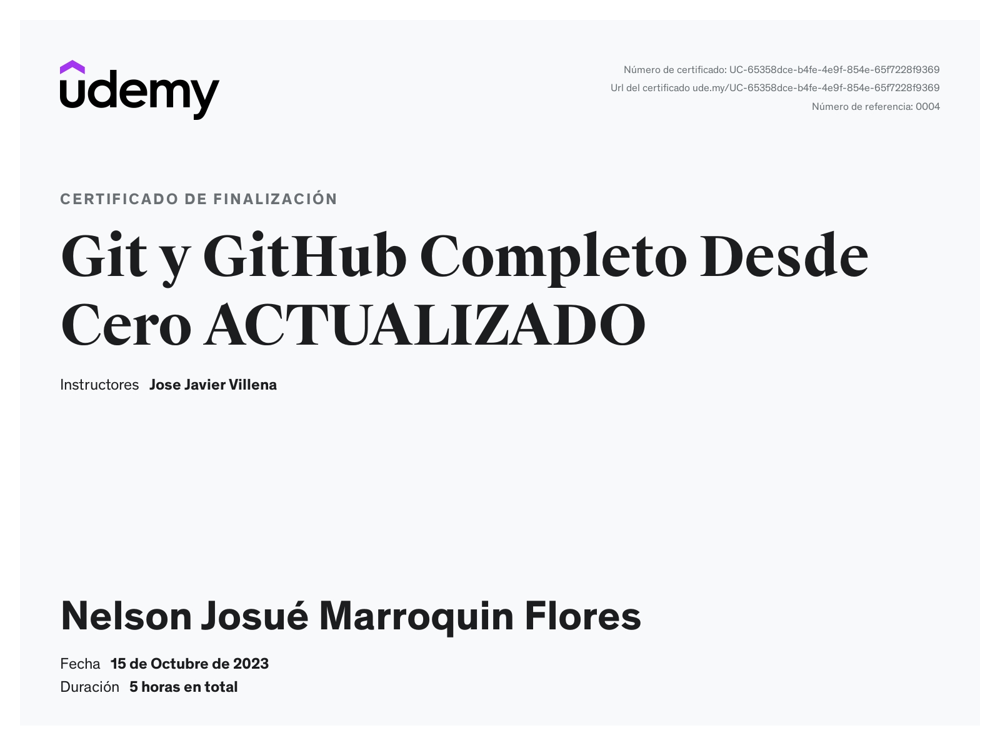

## Certificaciones

Además de mi formación universitaria, he complementado mis conocimientos con 
los siguientes cursos y certificaciones para seguir creciendo como desarrollador:

### Curso de APIs con .NET
- Plataforma: Platzi
- Duración: 9 horas en total
- Fecha de finalización: 22 de Septiembre de 2026
  

---

### Curso de Backend con ExpressJS
- Plataforma: Platzi
- Duración: 19 horas en total
- Fecha de finalización: 9 de Junio de 2026

---

### SQL - Curso completo de Bases de Datos - de 0 a Avanzado
- Plataforma: Udemy
- Duración: 21 horas en total
- Fecha de finalización: 8 de Noviembre de 2023

---

### Diseño de Bases de Datos Relacionales
- Plataforma: Udemy
- Duración: 11 horas en total
- Fecha de finalización: 5 de Noviembre de 2023

---

### Git y GitHub Completo Desde Cero ACTUALIZADO
- Plataforma: Udemy
- Duración: 5 horas
- Fecha de finalización: 15 de Octubre de 2023

---

## 🛠️ Tecnologías

PHP · Laravel · JavaScript · Node.js · Express · Vue.js · MySQL · SQL Server · C# · Git/GitHub
